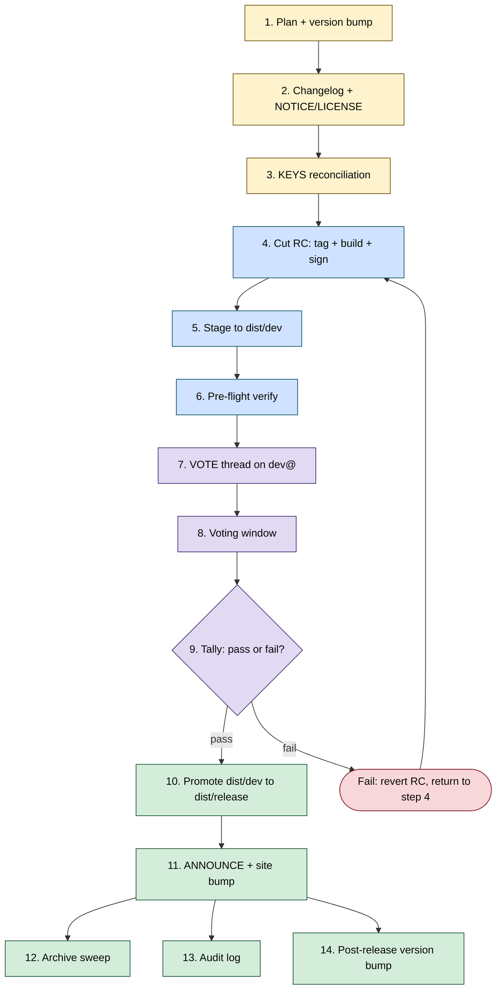
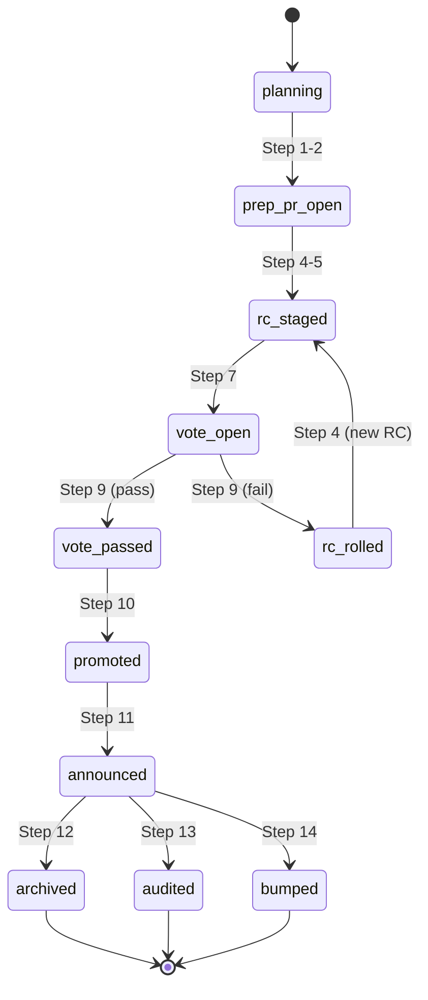

<!-- START doctoc generated TOC please keep comment here to allow auto update -->
<!-- DON'T EDIT THIS SECTION, INSTEAD RE-RUN doctoc TO UPDATE -->
**Table of Contents**  *generated with [DocToc](https://github.com/thlorenz/doctoc)*

- [Release-management workflow: process and label lifecycle](#release-management-workflow-process-and-label-lifecycle)
  - [Adopter backends](#adopter-backends)
  - [Process reference: the 14 steps](#process-reference-the-14-steps)
    - [Step 1: Release planning + version bump](#step-1-release-planning--version-bump)
    - [Step 2: Changelog, NOTICE, LICENSE](#step-2-changelog-notice-license)
    - [Step 3: `KEYS` reconciliation](#step-3-keys-reconciliation)
    - [Step 4: Cut the release candidate](#step-4-cut-the-release-candidate)
    - [Step 5: Stage to `dist/dev/`](#step-5-stage-to-distdev)
    - [Step 6: Pre-flight RC verification](#step-6-pre-flight-rc-verification)
    - [Step 7: `[VOTE]` thread on `dev@`](#step-7-vote-thread-on-dev)
    - [Step 8: Voting window](#step-8-voting-window)
    - [Step 9: Tally + `[RESULT] [VOTE]`](#step-9-tally--result-vote)
    - [Step 10: Promote `dist/dev/` to `dist/release/`](#step-10-promote-distdev-to-distrelease)
    - [Step 11: `[ANNOUNCE]` + site bump](#step-11-announce--site-bump)
    - [Step 12: Archive sweep](#step-12-archive-sweep)
    - [Step 13: Audit log](#step-13-audit-log)
    - [Step 14: Post-release version bump](#step-14-post-release-version-bump)
  - [Label lifecycle](#label-lifecycle)
    - [State diagram](#state-diagram)
    - [Label reference](#label-reference)
  - [Cross-references](#cross-references)

<!-- END doctoc generated TOC please keep comment here to allow auto update -->

<!-- SPDX-License-Identifier: Apache-2.0
     https://www.apache.org/licenses/LICENSE-2.0 -->

# Release-management workflow: process and label lifecycle

The authoritative reference for the 14-step release lifecycle and
the label-lifecycle state diagram the [release-management
skills](../../skills/) execute against. The
[family README](README.md) lists the skills; this document is the
process they share. The [spec](spec.md) defines per-skill scope,
state-change boundary, and adopter knobs.

The lifecycle is described in **ASF terminology by default**
(svnpubsub on `dist.apache.org`, `[VOTE]` on `dev@`, `[ANNOUNCE]`
on `announce@apache.org`), because the framework's first pilots
include an ASF PMC release. Every step that touches an ASF-specific
surface is implemented as a *backend call* the adopter selects in
[`release-management-config.md`](../../projects/_template/release-management-config.md),
not a hard-coded operation. Non-ASF adopters resolve the same
abstract step to their own backend; see the
[Adopter backends](#adopter-backends) section for the dimensions
and the per-step backend mapping.

## Adopter backends

Three dimensions parametrise the lifecycle. Each adopter picks one
value per dimension in `release-management-config.md`. The 14
steps stay identical; only the backend the agent emits commands
against changes.

| Dimension | Config key | ASF default | Non-ASF examples |
|---|---|---|---|
| Distribution backend | `release_dist_backend` | `svnpubsub` (`svn import` to `dist/dev/`, `svn mv` to `dist/release/`) | `github-releases` (`gh release upload` / `gh release edit --draft=false`), `s3` (`aws s3 cp` / `aws s3 mv`), `self-hosted` (project-supplied command template) |
| Approval mechanism | `release_approval_mechanism` | `dev-list-vote` (`[VOTE]` thread on `dev@<project>.apache.org`, 72h window, 3 binding +1, more +1 than -1) | `github-discussion` (named Discussion thread on `<upstream>` repo), `pr-approval` (a "release-NN" PR with approvals from the configured roster), `maintainer-roster` (signed approvals from a named roster file) |
| Announcement backend | `release_announce_backend` | `announce-list` (mail to `announce@apache.org`, cc `dev@`, `users@`) | `github-release-notes` (the release-page body is the announcement), `site-post` (a blog post in `site_repo`), `discord-channel` (a webhook into a named channel) |

Each `release-*` skill consults the relevant key and emits
backend-shaped paste-ready commands. The state-change boundaries
([spec § Cross-cutting commitments](spec.md#cross-cutting-commitments))
do not change: the agent still emits a recipe; the human still
runs it. Swapping `svn` for `gh release upload` swaps the
backend, not the boundary.

The vote-tally roster (`release-vote-tally`) reads from the
adopter's `pmc-roster.md` for ASF projects, or
`<release_approver_roster_path>` (typically
`<project-config>/release-approvers.md`) for non-ASF adopters; both
files share the same schema (handle, binding-flag, optional GPG
fingerprint).

> [!IMPORTANT]
> Release Management is **proposed** in the framework today. No
> `release-*` skill code exists yet. This document, the family
> [`README.md`](README.md), the [`spec.md`](spec.md), and
> [`projects/_template/release-management-config.md`](../../projects/_template/release-management-config.md)
> land first so the lifecycle, the state-change boundaries, and the
> adopter contract are reviewable independently from the runtime
> behaviour. The pattern matches [Mentoring](../mentoring/spec.md).
> See [`docs/modes.md` § Drafting / Triage](../modes.md#drafting)
> for status.

## Process reference: the 14 steps

This is the authoritative outline of the 14-step lifecycle. Each
step links to the skill that owns it (or marks it `proposed` if the
skill is not yet implemented). The brief descriptions below are an
overview, not a substitute for the linked skill's `SKILL.md`.

Two non-negotiable boundaries cross the lifecycle:

- **The agent never holds, invokes, or proxies the Release
  Manager's private signing key.** Any step that needs a signature
  emits a paste-ready command sequence; the RM runs it on their own
  machine, as themselves. This mirrors the
  [`security-cve-allocate`](../../skills/security-cve-allocate/SKILL.md)
  pattern (Vulnogram URL + paste-ready JSON, human submits) and
  satisfies [RFC-AI-0004 Principle 1](../rfcs/RFC-AI-0004.md#principle-1--human-in-the-loop-on-every-state-change).
- **The agent never publishes the release.** Steps 10
  (`svn mv dist/dev → dist/release`) and 11 (`[ANNOUNCE]` send,
  site bump merge) are the moments of release; the agent drafts
  artefacts, the RM and the PMC execute and merge.

Colour key: yellow = preparation, blue = release candidate, purple =
vote, green = publication and follow-up.

### Step 1: Release planning + version bump

**Owner:** PMC + nominated Release Manager (RM).
**Skill:** `release-prepare`
*(proposed)*, Drafting.

The RM opens a planning issue listing the target version, the
release train it belongs to (see
[`<project-config>/release-trains.md`](../../projects/_template/release-trains.md)),
the cut-off commit, and the issues / PRs in scope. The skill drafts
that planning issue from the configured release-train metadata, then
drafts the version-bump PR (e.g. `pom.xml`, `pyproject.toml`,
`Cargo.toml`, `setup.py`, package manifests). The PR remains in
draft until the RM marks it ready; the agent never marks ready, never
merges.

For non-ASF adopters with no release-train concept the planning step
collapses to a tag-and-PR pair; the skill detects the absence of
[`<project-config>/release-trains.md`](../../projects/_template/release-trains.md)
and adapts.

### Step 2: Changelog, NOTICE, LICENSE

**Owner:** RM.
**Skill:** `release-prepare`
*(proposed)*, Drafting (same skill as Step 1, second invocation).

The skill drafts the changelog entry from the merged-PR set since
the previous release tag, the `NOTICE` diff (third-party
attributions added or removed), and the `LICENSE` diff if any
license-categorised dependency changed
([ASF Category-A/B/X policy](https://www.apache.org/legal/resolved.html)).
The skill flags any Category-X dependency for the RM to remove before
the cut and refuses to advance the planning issue until that flag
clears.

Output: a single PR proposed against the release branch, RM merges
after their own review.

> [!NOTE]
> The Step 2 `LICENSE` / `NOTICE` draft is *provisional*. It is
> drafted before the build, so it covers only content the skill can
> see in the source tree; build-time-only or generated dependencies
> are not yet visible. Step 6's
> [Apache RAT](https://creadur.apache.org/rat/) pass verifies
> `LICENSE` / `NOTICE` against the actual built artefact, and that
> verification, not the Step 2 draft, is authoritative.

### Step 3: `KEYS` reconciliation

**Owner:** RM.
**Skill:** `release-keys-sync`
*(proposed)*, Drafting.

If the RM is signing their first release for the project, their
public key must appear in the project's `KEYS` file under
`dist/release/<project>/KEYS`. The skill drafts the `KEYS` diff
(public-key block appended in the project's existing format),
emits the `svn` command sequence to commit it, and reminds the RM
that the key must also be uploaded to a public keyserver per
[the ASF release-signing FAQ](https://infra.apache.org/release-signing.html).
The agent never holds the private key and never runs `svn commit`;
the RM executes both as themselves.

If the RM's key is already present and unchanged, the skill is a
no-op and reports so on the planning issue.

### Step 4: Cut the release candidate

**Owner:** RM.
**Skill:** `release-rc-cut`
*(proposed)*, Drafting.

The skill emits a paste-ready command sequence:

1. `git tag -s <version>-rcN -m "..."` (signed tag, RM's key).
2. Build invocation, project-specific
   (`<project-config>/release-build.md`).
3. `gpg --detach-sign --armor <artefact>` for each artefact.
4. `sha512sum <artefact> > <artefact>.sha512` for each artefact.

The skill writes nothing to disk and runs nothing locally. The RM
runs every command on their own machine, with their own key, in
their own checkout. The skill's output is the *recipe*; correctness
of the recipe is reviewable independently from execution. After the
RM reports back the artefact list + checksums + sig filenames, the
skill records them in the planning issue's audit-trail comment for
Step 13.

> [!NOTE]
> Detached `.asc` signatures and `.sha512` checksums are the ASF
> baseline; some projects also publish `.sha256` for older
> downstream tools. `MD5` and `SHA-1` are prohibited for new
> releases per
> [release-distribution § sigs-and-sums](https://infra.apache.org/release-distribution.html#sigs-and-sums),
> and signatures are published as detached `.asc` only, never a
> binary `.sig`. The skill reads
> [`<project-config>/release-build.md`](../../projects/_template/release-build.md)
> to determine which digests apply.

### Step 5: Stage to `dist/dev/`

**Owner:** RM.
**Skill:** `release-rc-cut`
*(proposed)*, Drafting (same skill as Step 4).

The skill emits the `svn` command sequence to import the artefacts
+ `.asc` + `.sha512` files into
`https://dist.apache.org/repos/dist/dev/<project>/<version>-rcN/`
(svnpubsub-backed, automatically mirrored to the public
`dist.apache.org` host per the
[release-distribution documentation](https://infra.apache.org/release-distribution.html)).
The RM commits with their ASF credentials; the skill never holds
those credentials.

Output: the staging URL and the candidate artefact list, written
back to the planning issue.

### Step 6: Pre-flight RC verification

**Owner:** RM (self-check) + any committer who plans to vote.
**Skill:** `release-verify-rc`
*(proposed)*, Triage / Pairing.

Read-only. The skill fetches the staged artefacts from
`dist/dev/<project>/<version>-rcN/`, then verifies:

- **Signatures.** `gpg --verify <artefact>.asc <artefact>` against
  the project's `KEYS` file (NOT against the RM's keyring, Step 3's
  `KEYS` is the project's source of truth).
- **Checksums.** `sha512sum -c` against the published `.sha512` (and
  `.sha256` where configured).
- **License headers** on source artefacts, per
  [Apache RAT](https://creadur.apache.org/rat/) configuration
  shipped with the adopter.
- **`NOTICE` and `LICENSE` presence** at the artefact root, content
  diff against the previous release.
- **No prohibited binaries** in the source artefact (per
  [`<project-config>/release-build.md`](../../projects/_template/release-build.md)
  binary-exclusion list).
- **Version string consistency** between artefact filename, embedded
  manifests, and tag.

The skill emits a pass/fail report to the planning issue. A failure
does not auto-flip any label; the RM decides whether to roll a new
RC (back to Step 4) or fix the verification source itself (e.g.
update RAT excludes).

This skill is the most valuable Pairing-mode candidate in the family:
voters run it in their own dev loop before posting a `+1` so the
mechanical verification work is done before the human-to-human vote
conversation.

### Step 7: `[VOTE]` thread on `dev@`

**Owner:** RM.
**Skill:** `release-vote-draft`
*(proposed)*, Drafting.

The skill drafts the `[VOTE]` email body to `dev@<project>` from
the planning issue's metadata: version, RC number, staging URL,
tag URL, KEYS URL, changelog URL, voting-window deadline
(per the [release-policy.html § release approval](https://www.apache.org/legal/release-policy.html#release-approval)
baseline, the configured per-project window in
[`<project-config>/release-management-config.md`](../../projects/_template/release-management-config.md)
overrides). The RM sends the email; the skill never sends mail.

The skill simultaneously drafts a `[VOTE]` notification on the
planning issue for committer awareness; that PR / issue comment is
also proposed, not auto-posted.

### Step 8: Voting window

**Owner:** PMC voters (binding) + committers / community
(non-binding).
**Skill:** none, passive window.

No skill runs during the window. The planning issue carries the
`vote-open` label so other skills (Triage on adjacent issues,
Mentoring on the `[VOTE]` thread) can spot the window and behave
appropriately (e.g. Mentoring stays out of the `[VOTE]` thread per
its hand-off rules, vote discussion is PMC business).

### Step 9: Tally + `[RESULT] [VOTE]`

**Owner:** RM.
**Skill:** `release-vote-tally`
*(proposed)*, Triage.

After the window closes, the skill fetches the thread from the
project's mail archive (PonyMail by default), parses each reply,
classifies each vote (`+1` / `0` / `-1`), determines binding vs
non-binding by cross-referencing
[`<project-config>/pmc-roster.md`](../../projects/_template/pmc-roster.md)
with the From-address, and proposes the `[RESULT] [VOTE]` body. The
RM reviews and sends.

The tally is conservative: when a vote is ambiguous (binding voter
posts `+1 with one caveat`, or `+0.5`), the skill marks it
`AMBIGUOUS, needs RM call` and refuses to count it. A vote count
the RM cannot defend on `dev@` is worse than a slow tally.

Pass / fail follows the
[`release-policy.html § release approval`](https://www.apache.org/legal/release-policy.html#release-approval)
baseline (three binding `+1` minimum, more binding `+1` than `-1`);
the configured per-project rule in
[`<project-config>/release-management-config.md`](../../projects/_template/release-management-config.md)
overrides if the project demands stricter conditions.

On fail the planning issue gets the `rc-rolled` label, the RM
returns to Step 4 with a new RC number. The skill never closes the
planning issue on a failed vote.

### Step 10: Promote `dist/dev/` to `dist/release/`

**Owner:** RM.
**Skill:** `release-promote`
*(proposed)*, Drafting.

The skill emits a paste-ready `svn mv` command set that moves the
voted artefacts from
`https://dist.apache.org/repos/dist/dev/<project>/<version>-rcN/`
to `https://dist.apache.org/repos/dist/release/<project>/<version>/`,
together with the commit message template (referencing the
`[RESULT] [VOTE]` archive URL). The RM executes the `svn mv` + `svn
commit` under their own ASF credentials.

This is **the moment of release**. The skill writes nothing and
runs nothing; the human commit is the act.

The `dist/release/` tree is PMC-write-only by default
([release-policy.html](https://www.apache.org/legal/release-policy.html)).
If the RM is a committer but not a PMC member, the `svn mv` will
fail; the skill checks PMC membership against the roster and emits
an "ask a PMC member to publish" hand-off instead of the command
set (see [`release-promote` § hand-off](spec.md#release-promote)).

> [!NOTE]
> Per [release-distribution](https://infra.apache.org/release-distribution.html),
> mirrors propagate within ~24h. ASF policy also requires waiting
> at least one hour after the promote `svn commit` before updating
> the download page or sending the `[ANNOUNCE]`
> ([release-policy.html](https://www.apache.org/legal/release-policy.html)).
> The skill writes the expected mirror-availability time and the
> earliest-announce time to the planning issue so Step 11 can wait.

### Step 11: `[ANNOUNCE]` + site bump

**Owner:** RM (`[ANNOUNCE]`) + PMC committers (site PR merge).
**Skill:** `release-announce-draft`
*(proposed)*, Drafting.

Two artefacts:

- **`[ANNOUNCE]` email body**, addressed to
  `announce@apache.org` (mandatory for ASF TLP releases per
  [release-policy.html § announcements](https://www.apache.org/legal/release-policy.html#release-announcements))
  with `dev@<project>` and `users@<project>` (or equivalent) on Cc.
  It may go out no sooner than one hour after the Step 10 promote
  commit, and the RM must send it from an `@apache.org` address,
  the announce list rejects other senders. The body links the
  project's Download Page, not a direct `dist.apache.org` URL. The
  RM sends.
- **Site-bump PR** updating the project website's download page,
  release notes, current-version banner, and any version-dependent
  navigation. Download links on that page resolve through the
  `closer.lua` mirror redirector, never a hard-coded
  `dist.apache.org` path
  ([release-distribution](https://infra.apache.org/release-distribution.html)).
  The PR is opened against the site repo configured in
  [`<project-config>/site-repo.md`](../../projects/_template/site-repo.md);
  a committer merges.

The skill never sends the `[ANNOUNCE]` email and never merges the
site PR.

### Step 12: Archive sweep

**Owner:** RM (or whoever holds release-archive duty per
[`<project-config>/release-management-config.md`](../../projects/_template/release-management-config.md)).
**Skill:** `release-archive-sweep`
*(proposed)*, Triage.

Per [release-distribution § archiving](https://infra.apache.org/release-distribution.html),
only the current release line is kept on `dist/release/`;
non-current releases must be moved to
`archive.apache.org`. The skill reads the configured retention
rule (per-project, in
[`<project-config>/release-management-config.md`](../../projects/_template/release-management-config.md);
the ASF baseline is "only the latest version of each supported
line"), lists releases past retention, and proposes the `svn mv`
sequence to move them to `dist/release/<project>/archive/` or the
equivalent
[archive.apache.org](https://archive.apache.org/dist/) location
the project's `<project-config>` declares.

The skill never runs `svn mv` itself. The RM executes the sequence
under their own credentials.

### Step 13: Audit log

**Owner:** the framework (per-project audit-log store configured in
[`<project-config>/release-management-config.md`](../../projects/_template/release-management-config.md)).
**Skill:** `release-audit-report`
*(proposed)*, Triage (read-only dashboard).

Read-only. The skill assembles a per-release record from the
planning issue, the `[VOTE]` and `[RESULT]` archive URLs, the
voter list with binding flags, the RC artefact list with sigs and
checksums, the promotion `svn` revision, and the `[ANNOUNCE]`
archive URL. The output is a structured markdown report appended
to the project's audit log (e.g.
`<project-config>/audit/releases/<version>.md` in the adopter
repo).

The report is the project's evidence trail for compliance, board
reporting, supply-chain queries, and reproducibility. The skill
does not modify the artefacts it summarises.

### Step 14: Post-release version bump

**Owner:** RM.
**Skill:** `release-prepare`
*(proposed)*, Drafting (same skill as Steps 1-2, third
invocation).

The skill drafts the PR that bumps the development branch to the
next `-SNAPSHOT` / `dev` / `next` version, depending on the
project's manifest format. Runs in parallel with Step 12, the
two steps share no state.

## Label lifecycle

### State diagram

The planning issue carries a single status label at any point.
Skills propose label transitions; the RM applies them.

### Label reference

| Label | Applied at | Removed at | Skill that proposes |
|---|---|---|---|
| `release-planning` | Step 1 | Step 2 (prep PR opens) | `release-prepare` |
| `prep-pr-open` | Step 2 | Step 4 (RC tag exists) | `release-prepare` |
| `rc-staged` | Step 5 | Step 7 (`[VOTE]` posted) or Step 9-fail | `release-rc-cut` |
| `vote-open` | Step 7 | Step 9 | `release-vote-draft` |
| `vote-passed` | Step 9 (pass) | Step 10 (promote committed) | `release-vote-tally` |
| `rc-rolled` | Step 9 (fail) | Step 5 (new RC staged) | `release-vote-tally` |
| `promoted` | Step 10 | Step 11 (`[ANNOUNCE]` sent) | `release-promote` |
| `announced` | Step 11 | Step 12 (archive sweep done) | `release-announce-draft` |
| `archived` | Step 12 | terminal | `release-archive-sweep` |

The `release-audit-report` skill (Step 13) reads every label
transition but proposes none of its own; it is a dashboard, not a
state machine participant.

## Cross-references

- [`README.md`](README.md), family overview, skill table.
- [`spec.md`](spec.md), per-skill scope, state-change boundary,
  hand-off protocol, adopter knobs.
- [`projects/_template/release-management-config.md`](../../projects/_template/release-management-config.md), adopter contract scaffold.
- [`docs/modes.md` § Drafting](../modes.md#drafting),
  [`§ Triage`](../modes.md#triage), the modes the skills inhabit.
- [`MISSION.md` § Initial Goals](../../MISSION.md#initial-goals),
  the `Cut a first Apache release through the standard process
  within 3 months` commitment this family operationalises.
- [`docs/rfcs/RFC-AI-0004.md` § Principle 1](../rfcs/RFC-AI-0004.md#principle-1--human-in-the-loop-on-every-state-change), the human-in-the-loop rule every state-change boundary in
  this lifecycle inherits.
- [ASF release policy](https://www.apache.org/legal/release-policy.html), canonical.
- [ASF release distribution](https://infra.apache.org/release-distribution.html), `dist/dev/` + `dist/release/` mechanics, mirror propagation,
  archive policy.
- [ASF release signing FAQ](https://infra.apache.org/release-signing.html), `KEYS` file and signing-key onboarding.
- [ASF licensing-howto](https://www.apache.org/legal/resolved.html), Category-A/B/X dependency rules referenced by Step 2.
- [Apache RAT](https://creadur.apache.org/rat/), license-header
  verification referenced by Step 6.
