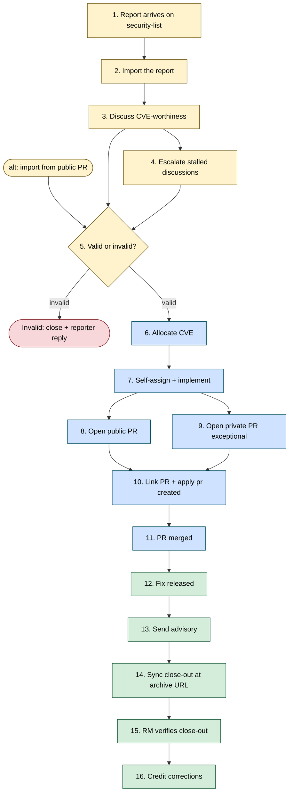
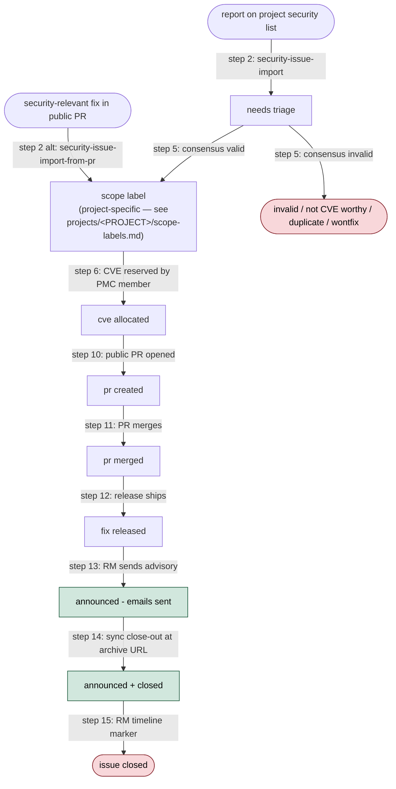

<!-- START doctoc generated TOC please keep comment here to allow auto update -->
<!-- DON'T EDIT THIS SECTION, INSTEAD RE-RUN doctoc TO UPDATE -->
**Table of Contents**  *generated with [DocToc](https://github.com/thlorenz/doctoc)*

- [Security workflow — process and label lifecycle](#security-workflow--process-and-label-lifecycle)
  - [Process reference: the 16 steps](#process-reference-the-16-steps)
    - [Step 1 — Report arrives on security@](#step-1--report-arrives-on-security)
    - [Step 2 — Import the report](#step-2--import-the-report)
    - [Step 3 — Discuss CVE-worthiness](#step-3--discuss-cve-worthiness)
    - [Step 4 — Escalate stalled discussions](#step-4--escalate-stalled-discussions)
    - [Step 5 — Land the valid/invalid consensus](#step-5--land-the-validinvalid-consensus)
    - [Step 6 — Allocate the CVE](#step-6--allocate-the-cve)
    - [Step 7 — Self-assign and implement the fix](#step-7--self-assign-and-implement-the-fix)
    - [Step 8 — Open a public PR (straightforward cases)](#step-8--open-a-public-pr-straightforward-cases)
    - [Step 9 — Open a private PR (exceptional cases)](#step-9--open-a-private-pr-exceptional-cases)
    - [Step 10 — Link the PR and apply `pr created`](#step-10--link-the-pr-and-apply-pr-created)
    - [Step 11 — PR merged](#step-11--pr-merged)
    - [Step 12 — Fix released](#step-12--fix-released)
    - [Step 13 — Send the advisory](#step-13--send-the-advisory)
    - [Step 14 — Capture the public advisory URL and close out](#step-14--capture-the-public-advisory-url-and-close-out)
    - [Step 15 — RM verifies the close-out landed](#step-15--rm-verifies-the-close-out-landed)
    - [Step 16 — Credit corrections](#step-16--credit-corrections)
  - [Label lifecycle](#label-lifecycle)
    - [State diagram](#state-diagram)
    - [Label reference](#label-reference)

<!-- END doctoc generated TOC please keep comment here to allow auto update -->

<!-- SPDX-License-Identifier: Apache-2.0
     https://www.apache.org/licenses/LICENSE-2.0 -->

# Security workflow — process and label lifecycle

The authoritative reference for the 16-step security-issue
lifecycle and the label-lifecycle state diagram. The
[role guides](roles.md) point into specific steps; the
[security skills](../../skills/) execute the steps; the
[threat model](threat-model.md) maps the steps and skills to trust
boundaries, adversaries, and mitigations.

<!-- Placeholder convention (see AGENTS.md#placeholder-convention-used-in-skill-files):
     `<cve-tool>` → the adapter directory under `tools/` named by
                    `cve_authority.tool:` in `<project-config>/project.md`.
                    The contract this directory implements is
                    [`tools/cve-tool/`](../../tools/cve-tool/README.md);
                    today the only adapter shipping in the framework is
                    `tools/cve-tool-vulnogram/` (the ASF default, selected
                    by `cve_authority.tool: vulnogram`). Other adopters
                    point `cve_authority.tool` at a sibling
                    `tools/cve-tool-<name>/` directory. -->

## Process reference: the 16 steps

This is the authoritative outline of the 16-step lifecycle. Each step
links to the skill or document that owns the deep mechanics — the
brief descriptions below are an overview, not a substitute for the
linked skill's `SKILL.md`. If the role sections above conflict with
what is here, this reference wins.

Colour key: yellow = triager (Steps 1–5), blue = remediation
developer (Steps 6–11), green = release manager (Steps 12–16),
red = terminal close.

### Step 1 — Report arrives on security@

The reporter sends the issue to the adopting project's
`<security-list>` (or to `security@apache.org`, which forwards to the
project list).

### Step 2 — Import the report

[`security-issue-import`](../../skills/security-issue-import/SKILL.md)
scans `<security-list>` for un-imported threads, classifies each
candidate (real / automated-scan / consolidated / spam), extracts the
issue-template fields from the root message, and proposes one tracker
per valid report plus a Gmail receipt-of-confirmation draft. Nothing
is applied without explicit confirmation. The newly-created tracker
lands with `needs triage`.

If the report matches a known-invalid pattern, the skill drafts the
matching canned reply from
[`<project-config>/canned-responses.md`](<project-config>/canned-responses.md)
and does **not** create a tracker — invalid noise never enters the
board.

**Alternate entry — fix already opened as a public PR.** Use
[`security-issue-import-from-pr`](../../skills/security-issue-import-from-pr/SKILL.md).
The tracker lands directly in the `Assessed` column with the scope
label applied (validity already decided informally), so Step 5 is
skipped and the tracker is ready for `security-cve-allocate`
immediately.

**Alternate entry — bulk import from markdown.** Use
[`security-issue-import-from-md`](../../skills/security-issue-import-from-md/SKILL.md)
when triaging the output of an AI security review or third-party
scanner. Each finding becomes one tracker.

### Step 3 — Discuss CVE-worthiness

Drive the validity assessment in tracker comments. Pull at least
one other security-team member into the discussion. Use canned
responses from
[`<project-config>/canned-responses.md`](<project-config>/canned-responses.md)
for negative assessments so the tone stays polite-but-firm.

For larger batches landed by `security-issue-import` (or the
`-from-md` / `-from-pr` variants), the
[`security-issue-triage`](../../skills/security-issue-triage/SKILL.md)
skill automates the first half of this step: for each tracker
in `Needs triage`, it reads the body + comments, applies the
project's Security Model framing, and — on user confirmation —
posts a top-level **triage-proposal comment** that classifies
the candidate disposition into one of six classes and
`@`-mentions 2-3 security-team members for input. The
proposal-comment shape is:

- a one-paragraph technical summary in the triager's own words;
- the proposed class, with severity guess (the team scores
  independently per the no-reporter-CVSS rule);
- a one-sentence fix shape (or "why not" framing for negative
  classes);
- a specific question for the `@`-mentioned reviewers.

The six disposition classes route to different next-steps once
team consensus lands:

| Class | Next step after consensus |
|---|---|
| `VALID` | [`security-cve-allocate`](../../skills/security-cve-allocate/SKILL.md) → Step 6 |
| `DEFENSE-IN-DEPTH` | Close as wontfix + open a public PR for the hardening |
| `INFO-ONLY` | [`security-issue-invalidate`](../../skills/security-issue-invalidate/SKILL.md) with the matching canned-response template |
| `INVALID` | [`security-issue-invalidate`](../../skills/security-issue-invalidate/SKILL.md) |
| `PROBABLE-DUP` | [`security-issue-deduplicate`](../../skills/security-issue-deduplicate/SKILL.md) |
| `FIX-ALREADY-PUBLIC` | After reporter confirms the cited public PR fixes their report: [`security-issue-invalidate`](../../skills/security-issue-invalidate/SKILL.md). If the reporter says it does not fix it, re-triage with `--retriage`. No finder credit is recorded per the [no-credit-when-fix-is-already-public policy](../../skills/security-issue-import-from-pr/SKILL.md#reporter-credit-policy-for-public-pr-imports). |

The triage skill is **read-only** on tracker state — it never
flips `needs triage` to a scope label, never closes, never
allocates a CVE. The valid/invalid decision belongs to team
consensus; this skill opens the discussion that produces it,
and one of the next-step skills above (or a hand-applied label
change via Step 5) lands the actual state transition. A
`--retriage` mode is available for re-litigating passed-triage
decisions when substantive new comment activity lands.

### Step 4 — Escalate stalled discussions

If discussion stalls for ~30 days, escalate in **two phases**:

* **Phase 1 — short call for ideas.** A 3-4-paragraph message that
  states the report exists and asks the wider audience for input.
  No AI analysis, no proposed fixes — phase 1 is deliberately bare so
  domain experts can weigh in with novel ideas without being anchored
  to a pre-baked solution.
* **Phase 2 — AI-generated design-space analysis.** Triggered if
  phase 1 stays silent for ~7 more days. The agent drafts a
  structured analysis (TL;DR, why-the-obvious-fix-is-insufficient,
  options A/B/C with trade-offs, open design questions, tagged
  reviewers per a documented selection methodology). The triager
  reviews and approves before posting.

Audiences are the same for both phases: `<private-list>`,
`security@apache.org`, the original reporter. Both phases land as
rollup entries on the tracker (per
[`tools/github/status-rollup.md`](../../tools/github/status-rollup.md))
with the action label `Sync (Step 4 escalation)`.

### Step 5 — Land the valid/invalid consensus

If valid, apply exactly one scope label from
[`<project-config>/scope-labels.md`](<project-config>/scope-labels.md);
remove `needs triage`. If invalid,
[`security-issue-invalidate`](../../skills/security-issue-invalidate/SKILL.md)
labels `invalid`, posts a closing comment, archives the board item,
and (for `<security-list>`-imported trackers) drafts a polite-but-firm
reporter reply. If consensus cannot be reached, follow
[ASF voting](https://www.apache.org/foundation/voting.html)
on `<security-list>`.

If a candidate duplicate is detected,
[`security-issue-deduplicate`](../../skills/security-issue-deduplicate/SKILL.md)
merges two trackers in place — preserving every reporter's credit,
every mailing-list thread reference, and every independent
attack-vector description. The kept issue's body is updated, the
duplicate is closed with the `duplicate` label, and the CVE JSON
attachment is regenerated so both finders land in `credits[]`.

### Step 6 — Allocate the CVE

[`security-cve-allocate`](../../skills/security-cve-allocate/SKILL.md)
opens the project's CVE allocation tool (URL + tool name declared
in [`<project-config>/project.md → CVE tooling`](<project-config>/project.md#cve-tooling)),
normalises the title per
[`<project-config>/title-normalization.md`](<project-config>/title-normalization.md),
and — if the triager isn't on the PMC — builds an `@`-mention relay
message for a PMC member. Once the allocated `CVE-YYYY-NNNNN` is
pasted back, the skill wires it into the tracker (CVE tool link
body field, `cve allocated` label, status-change comment, refreshed
CVE-JSON attachment) and hands off to `security-issue-sync` to
reconcile the rest.

### Step 7 — Self-assign and implement the fix

A security team member self-assigns and implements the fix.
Optional automation:
[`security-issue-fix`](../../skills/security-issue-fix/SKILL.md)
proposes an implementation plan, writes the change in your local
`<upstream>` clone, runs local tests, and opens a public PR via
`gh pr create --web` with a scrubbed title + body. Every public
surface (commit message, branch name, PR title, PR body, newsfragment)
is grep-checked for `CVE-`, the `<tracker>` slug, *"vulnerability"*,
*"security fix"*, and similar leakage before being written or pushed.

The skill refuses to proceed for reports still being assessed,
reports not yet classified as valid, and changes that require the
private-PR fallback (Step 9). Even when it succeeds end-to-end, you
remain the PR's author and reviewer-facing contact — stay on the PR
through review and merge.

Delegation to a trusted third-party individual is permitted under
LAZY CONSENSUS, sharing only the information required to implement
the fix.

### Step 8 — Open a public PR (straightforward cases)

The PR description **must not** reveal the CVE, the security nature
of the change, or link back to `<tracker>`. See
[`AGENTS.md → Confidentiality`](../../AGENTS.md#confidentiality-of-the-tracker-repository).
Request the appropriate `backport-to-vN-N-test` label on the public
PR when the fix should ship on a patch train.

### Step 9 — Open a private PR (exceptional cases)

For highly critical fixes or code that needs private review, open
the PR against `<tracker>`'s `main` branch first (not the
`tracker_default_branch` set in `<project-config>/project.md`). CI
does not run there — run static checks + tests manually. Once
approved, push the branch to `<upstream>` and re-open the PR there.

### Step 10 — Link the PR and apply `pr created`

The remediation developer links the PR in the tracker description
and applies `pr created` on `<tracker>`.

### Step 11 — PR merged

When the `<upstream>` PR merges, swap `pr created` → `pr merged`
and set the milestone of the release the fix will ship in (per
[`<project-config>/milestones.md`](<project-config>/milestones.md)).
Close any private variant in `<tracker>`. The tracker waits at
`pr merged` until the release ships — this can be hours (a hot-fix
patch release) or weeks (a regular project-cadence release).

### Step 12 — Fix released

When the release containing the fix ships to users (PyPI / Helm
registry / equivalent),
[`security-issue-sync`](../../skills/security-issue-sync/SKILL.md)
detects the release version on the next run and — provided a
**two-stage gate** is clear — proposes the `pr merged` →
`fix released` swap (and the assignee swap from remediation
developer to release manager) plus a one-shot
**release-manager hand-off comment** with a numbered checklist
of the three RM actions (promote the record from `review-ready`
to `publish-ready`, send the advisory, sync closes the rest)
and the per-record URLs the checklist points at — the record
page (`cve_authority.record_url_template`) and the advisory-email
preview (`cve_authority.email_preview_url_template`), both
declared in [`<project-config>/project.md → cve_authority`](<project-config>/project.md#cve-authority).
For the airflow-s adopter, those templates resolve to
`https://cveprocess.apache.org/cve5/<CVE-ID>` and the same URL
with `#email` appended — the Vulnogram `#source` and `#email`
tabs.

The two gates:

1. **Mandatory body fields populated.** Six fields must be
   non-empty and non-`_No response_`: *CWE*, *Affected versions*,
   *Severity*, *Reporter credited as*, *Short public summary for
   publish*, *PR with the fix*. The same check fires earlier, at
   the `pr created` → `pr merged` transition (Step 11), so the
   remediation developer is nudged to fill fields as soon as the
   PR merges.
2. **CVE record state is `review-ready`.** Sync pushes the
   regenerated CVE JSON to the CVE tool via the
   [`<cve-tool>`](../../tools/cve-tool/README.md) adapter's
   `push_update()` method in the same pass (see *State
   auto-promote* in the sync skill); the generator promotes the
   record from `allocated` to `review-ready` once Stage 1 is
   clear, and `push_update()` is responsible for translating the
   generic state verb into whatever the adapter's tool requires.
   Sync then verifies the saved state via
   `<cve-tool>.fetch_current_state()`. (For the Vulnogram
   adapter, that translates to `state = "REVIEW"` on the JSON
   record, which `cveprocess.apache.org` accepts verbatim.)

If either gate fails, sync instead posts (or PATCH-updates) a
*Remediation-developer fill-fields comment* @-mentioning the
remediation developer with the specific blocker (which fields
are missing, or that the record is still in `allocated` after
the push). The tracker stays assigned to the remediation
developer and the RM hand-off comment is **not** posted on this
run — the RM never sees a hand-off while the record is still in
`allocated`. A later sync run that finds both gates clear
proceeds with the hand-off.

### Step 13 — Send the advisory

By the time the release manager receives the hand-off comment,
every mandatory CVE body field is already populated on the
tracker (Step 12's gate), the CVE JSON has been pushed via
`<cve-tool>.push_update()`, and the record is in `review-ready`
state. The RM's job is the three-step checklist in the
hand-off comment, all of it single clicks in the CVE tool —
**no shell commands, no JSON paste**:

1. **Address reviewer feedback (if any) and promote the record
   to `publish-ready`.** Open the record at
   `cve_authority.record_url_template` substituted with the
   tracker's CVE ID. If the CVE reviewer has posted comments
   (the channel is declared in `cve_authority.reviewer_channel`
   — `mailing-list` for the ASF default), work through them on
   the same channel; when the thread is clear, drive the
   record from `review-ready` to `publish-ready` per the tool's
   UI. Most CVEs go through `review-ready` with no reviewer
   comments — in that case the promotion is immediate. (For
   the Vulnogram adapter, that is the **State** dropdown
   flipping from `REVIEW` to `READY` on the record's `#source`
   tab.)
2. **Preview and send the advisory email.** Open
   `cve_authority.email_preview_url_template` substituted with
   the CVE ID. The page renders the exact advisory email that
   will go out. Verify the recipients (`<users-list>` and
   `<announce-list>`) and the body, then click **Send Email**.
   This is the only manual send action. (For the Vulnogram
   adapter, that is the record's `#email` tab.)
3. **Stop.** Sync drives the rest at the archive-URL trigger
   (Step 14). The RM does not paste JSON anywhere, does not
   promote the record from `publish-ready` to `public`, does
   not close the tracker.

The severity score follows the
[ASF severity rating](https://security.apache.org/blog/severityrating)
(lazy consensus during discussion; voting if there's
disagreement; the RM has the final say to keep the announcement
on schedule). The RM may still need to adjust body fields before
sending if reviewer feedback prompts it; the regenerated JSON is
re-pushed automatically by the next sync.

Sync does not flip `fix released → announced - emails sent` at
this step; that label transition fires at Step 14 along with the
rest of the post-advisory close-out. **The issue stays open** at
this point — it closes at Step 14.

### Step 14 — Capture the public advisory URL and close out

Once the announcement is archived on the users@ list, the next
`security-issue-sync` run detects the archive URL and fires a
**single combined apply** that drives the entire post-advisory
close-out — there is no separate RM "publish + close" step. In
one pass sync:

1. Populates the *Public advisory URL* body field (a dedicated
   field on the issue template — never reuses the *"Security
   mailing list thread"* field).
2. **Extracts the short public summary** from the archived
   advisory email body (the prose between the CVE header and the
   *Affected version range* block) and writes it back to the
   *Short public summary for publish* body field so the
   tracker's summary matches what actually shipped.
3. Flips the tracker labels: adds `announced - emails sent` and
   `announced`, removes `fix released`.
4. Regenerates the CVE JSON attachment — the generator picks up
   the new short summary as `descriptions[].value` and the URL
   as a `vendor-advisory` reference, and now records the
   tracker's promotion to `public`.
5. Re-pushes the regenerated JSON via the
   [`<cve-tool>`](../../tools/cve-tool/README.md) adapter's
   `push_update()` method.
6. Promotes the record from `publish-ready` to `public` via the
   adapter's `publish()` method — the CNA-feed dispatch to
   [`cve.org`](https://cve.org), formerly a manual UI click but
   now driven by sync since the archive URL is the real-world
   signal that the advisory has shipped. The exact wire
   mechanism depends on the adapter (`cve_authority.publication_propagation`
   declares whether sync `poll`s for the result, awaits a
   `webhook`, or treats the move as `manual`); for the
   Vulnogram adapter the implementation is
   [`vulnogram-api-record-publish`](../../tools/cve-tool-vulnogram/oauth-api/README.md)
   under `poll`.
7. Moves the project-board column to `Announced`.
8. Closes the tracker as `completed`.
9. Archives the tracker from the `Announced` column via the
   `archiveProjectV2Item` GraphQL mutation (see
   [`tools/github/project-board.md` — *Archive a board item*](../../tools/github/project-board.md#archive-a-board-item--terminal-state-cleanup)).
10. **If every sibling on the tracker's milestone is also closed
    at that moment**, closes the milestone too.
11. Posts a purely-informational *wrap-up comment* tagging the
    RM as a timeline marker that the lifecycle is complete. No
    manual asks — everything actionable was already taken care
    of by the steps above.

Until *Public advisory URL* is populated, the sync skill will
not propose `announced` or any of the downstream steps —
promoting a CVE record to `public` with an empty
`vendor-advisory` reference would leak a broken record into
[`cve.org`](https://cve.org).

When the adapter's write path is not available (no credentials,
expired session, transient HTTP error on the `push_update()` or
`publish()` call), the JSON re-push and the
`publish-ready → public` promotion and the tracker close all
defer to the next sync that resolves the push issue; the
manual-paste variant of the publication-ready notification
comment is posted in that case explaining the deferral.

### Step 15 — RM verifies the close-out landed

There is no manual close step. The release manager's last
post-Send-Email action is **none** — sync at Step 14 closes the
tracker, promotes the CVE record to `public` via
`<cve-tool>.publish()`, archives the board item, and
(conditionally) closes the milestone. The RM receives the
wrap-up comment as a timeline event marker.

A tracker that sits on `announced - emails sent` without
`announced` for more than a day or two is a signal that sync
did not see the advisory in the `<users-list>` archive yet
(propagation lag, search-engine miss); re-run sync or wait for
the next scheduled pass.

### Step 16 — Credit corrections

If credits need correction post-announcement, the release manager:

* responds to the announcement emails with the missing credits;
* updates the project's CVE tool with the missing credits;
* asks the ASF security team to push the information to
  [`cve.org`](https://cve.org).

## Label lifecycle

### State diagram

The diagram below shows the typical state flow. Each node is a label (or a
cluster of labels that co-exist); each edge is a process step that moves
the issue forward. Closing dispositions (`invalid`, `not CVE worthy`,
`duplicate`, `wontfix`) can terminate the flow at any point after
`needs triage`.

The dashed-equivalent entry from `A2` represents the deliberate-import
path described in [Step 2](#step-2--import-the-report) above:
trackers opened from a public PR skip the `needs triage` column and
land directly at `scope label` (the `Assessed` column on the project
board) because the validity assessment has already happened
informally before invocation.

### Label reference

The table below repeats the same flow in tabular form. An issue typically
moves through these labels left-to-right.

**Scope labels are project-specific** — the adopting project's concrete
scope labels live in
[`<project-config>/scope-labels.md`](../../projects/) (for the currently
adopting project, [`<project-config>/scope-labels.md`](<project-config>/scope-labels.md)).
The table below uses `<scope>` as a placeholder for whichever scope
labels the adopting project defines.

| Label | Meaning | Added at step | Removed at step |
| --- | --- | --- | --- |
| `needs triage` | Freshly filed; assessment not yet started. | 1 | 5 |
| `<scope>` | Scope of the vulnerability. Exactly one project-specific scope label is set. | 5 | never (sticks for the lifetime of the issue) |
| `cve allocated` | A CVE has been reserved for the issue. Allocation itself is PMC-gated (only the adopting project's PMC members can submit the CVE-tool allocation form); a non-PMC triager relays a request to a PMC member via the [`security-cve-allocate`](../../skills/security-cve-allocate/SKILL.md) skill. | 6 | never |
| `pr created` | A public fix PR has been opened on `<upstream>` but has not yet merged. | 10 | 11 (replaced by `pr merged`) |
| `pr merged` | The fix PR has merged into `<upstream>`; no release with the fix has shipped yet. | 11 | 12 (replaced by `fix released` when the release ships) |
| `fix released` | A release containing the fix has shipped to users; advisory has not been sent yet. Gated on the two-stage check (six mandatory body fields populated + CVE record state `review-ready`). | 12 | 14 (replaced by `announced - emails sent` at the archive-URL combined apply) |
| `announced - emails sent` | The public advisory has been sent to the project's announce and users mailing lists (see `<project-config>/project.md → Mailing lists`). The issue **stays open** after this label is applied; closing happens at Step 14 once sync sees the advisory archived on `<users-list>`. | 14 (combined apply with `announced`) | never (stays on the issue after closing for audit history) |
| `announced` | The public advisory URL has been captured in the tracking issue's *Public advisory URL* body field and the attached CVE JSON has been regenerated so its `references[]` now carries the `vendor-advisory` URL. The CVE record has been promoted to `public` via `<cve-tool>.publish()` and the tracker has been closed and archived from the board — all in the same Step 14 combined apply. No label changes at close — the issue closes with `announced` still set. | 14 | never (stays on the issue after closing) |
| `wontfix` / `invalid` / `not CVE worthy` / `duplicate` | Closing dispositions for reports that are not valid or not CVE-worthy. | 5 / 6 | — |

The [`security-issue-sync`](../../skills/security-issue-sync/SKILL.md)
skill keeps these labels honest: on every run it detects the current state
of the issue, the fix PR, and the release train, and proposes the label
transitions the process requires.
